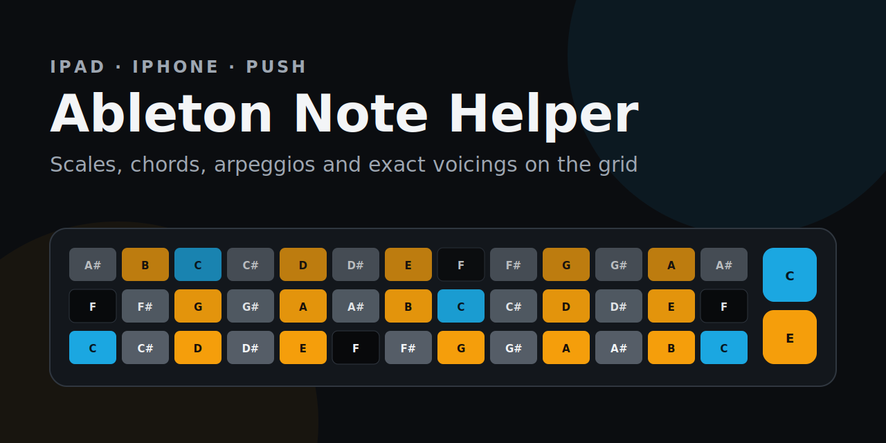

# Ableton Note Helper

[](https://github.com/krahd/ableton-note-helper/actions/workflows/pages.yml)
[](LICENSE)

A free, interactive reference for learning scales, modes, chords, arpeggios and exact voicings on Ableton Note and Push pad layouts. It runs entirely in the browser: no account, installation, analytics or tracking.

**[Open the live app](https://krahd.github.io/ableton-note-helper/)**



## What it does

- Three selectable layouts:
  - **iPad** — 13 columns × 5 rows, bottom-left C2, chromatic fourths.
  - **iPhone** — 5 columns × 5 rows, C2–C4, matching the compact Note grid.
  - **Ableton Push** — 8 columns × 8 rows, bottom-left C1, chromatic fourths.
- Multiple simultaneous charts with independently selectable roots and patterns.
- Scales, major-scale modes, melodic-minor modes, harmonic-minor modes, chords, arpeggios and exact voicings.
- Blue roots, orange pattern tones, black unused naturals and grey unused accidentals.
- Exact voicings illuminate one physical pad per note instead of every duplicate pitch occurrence.
- Tap pads to identify chord symbols, alternative interpretations and inversions.
- Remove individual notes from the analyser or clear the complete selection with one × button.
- Sharp/flat spelling, linked or independent roots, chart duplication and persistent preferences.
- Responsive, keyboard-accessible and dependency-free.

## Using the app

1. Choose **iPad**, **iPhone** or **Push**.
2. Select a global root and keep **Link chart roots** enabled to compare patterns in one key.
3. Choose a scale, chord, arpeggio or voicing in each chart.
4. Tap physical pads to assemble a chord. The analyser preserves octave and bass-note information so it can report inversions.
5. Tap a selected-note chip to remove one note, or use the adjacent × to clear all selected notes.

Preferences and charts are stored only in the browser's local storage. Selected notes are deliberately temporary and are not stored.

## Run locally

The application uses JavaScript modules, so serve the directory rather than opening `index.html` directly:

```sh
python3 -m http.server 8000
```

Then open <http://localhost:8000>.

## Test

Node.js 20 or later is required only for development:

```sh
npm test
```

The suite checks all three grid geometries, the iPhone mapping, every pattern definition, chord recognition, inversions, exact-voicing placement, duplicate-pad prevention and essential static-page wiring.

## Contributing

Corrections to theory data, device geometry, chord naming and accessibility are particularly useful. See [CONTRIBUTING.md](CONTRIBUTING.md).

## Deployment

GitHub Pages deploys automatically from `main` through `.github/workflows/pages.yml`, but only after syntax and deterministic tests pass.

## Independence and trademarks

This is an unofficial, independent open-source tool. It is not affiliated with or endorsed by Ableton. Ableton, Ableton Note and Push are names associated with Ableton AG and are used only to describe compatibility.

## Licence

[MIT](LICENSE)
